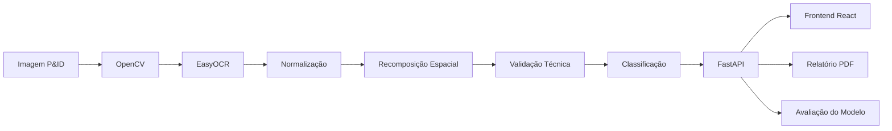

# TAGVision

TAGVision é uma solução para extração inteligente de informações em fluxogramas industriais e diagramas P&ID. O projeto combina processamento de imagem, OCR, validação técnica e visualização de resultados em uma interface web.

## Problema

Diagramas industriais podem ter baixa resolução, poluição visual, símbolos sobrepostos, textos fragmentados e variações de padrão entre plantas. Esses fatores dificultam a extração automática de TAGs e a classificação confiável de equipamentos, instrumentos e válvulas.

## Solução

O pipeline atual executa as seguintes etapas:

1. Recebe uma imagem de planta técnica pelo frontend.
2. Processa a imagem com OpenCV, incluindo escala de cinza, blur, limiarização e detecção de contornos.
3. Aplica OCR com EasyOCR nas regiões candidatas.
4. Normaliza textos reconhecidos.
5. Recompõe espacialmente TAGs fragmentadas, como prefixos e números detectados em regiões separadas.
6. Valida TAGs contra um catálogo técnico em CSV.
7. Classifica cada detecção por tipo, classe, grupo e status.
8. Expõe os resultados por uma API FastAPI.
9. Apresenta os dados em um frontend React/Vite com painéis de DataViz.
10. Gera relatório PDF para análises concluídas.

## Informações Extraídas

- TAG
- Tipo
- Classe
- Grupo
- Status
- Confiança OCR

## Grupos Suportados

- Equipamentos
- Válvulas / Atuadores
- Segurança / Proteção
- Controle
- Instrumentação
- Não cadastrado

## Arquitetura



## Avaliação

O projeto possui um framework de avaliação em `projeto/evaluation/`, baseado em um arquivo de ground truth revisado manualmente e nos resultados gerados pelo pipeline.

A amostra atual contém 6 diagramas e 116 TAGs de referência anotadas manualmente.

Resultados da avaliação atualmente registrada no projeto:

| Métrica | Valor |
|---|---:|
| Imagens avaliadas | 6 |
| TAGs de referência | 116 |
| TP | 33 |
| FP | 18 |
| FN | 83 |
| Precision | 64,7% |
| Recall | 28,4% |
| F1-Score | 0,3952 |

A Precision indica quantas das TAGs detectadas pelo sistema estavam corretas.  
O Recall indica quantas das TAGs realmente existentes nos diagramas foram encontradas.

Os resultados mostram que o principal desafio atual da solução é ampliar a cobertura das detecções, especialmente em TAGs pequenas, fragmentadas ou presentes em diagramas de baixa qualidade.

Esses resultados foram obtidos em uma amostra validada manualmente e não representam garantia de desempenho universal para qualquer diagrama industrial.

## Matriz de Confusão

O framework de avaliação também gera uma matriz de confusão para analisar o status das TAGs reconhecidas.

Arquivo gerado:

`projeto/evaluation/results/confusion_matrix_status.csv`

Matriz atual:

| Status real \ Status previsto | Identificado | Possível TAG | Desconhecido |
|---|---:|---:|---:|
| Identificado | 5 | 0 | 0 |
| Possível TAG | 0 | 28 | 0 |
| Desconhecido | 0 | 0 | 0 |

A matriz complementa as métricas de Precision, Recall e F1-Score e permite visualizar como as detecções reconhecidas foram classificadas pelo sistema.

## Como Executar

### Backend

Crie e ative um ambiente virtual Python, se necessário:

```bash
python -m venv .venv
```

No Windows:

```bash
.venv\Scripts\activate
```

Instale as dependências:

```bash
pip install -r projeto/requirements.txt
```

Inicie a API FastAPI:

```bash
python -m uvicorn projeto.api:app --reload
```

A API ficará disponível em:

```text
http://localhost:8000
```

### Frontend

Entre na pasta:

```bash
cd frontend
```

Instale as dependências:

```bash
npm install
```

Inicie o Vite:

```bash
npm run dev
```

O frontend ficará disponível em:

```text
http://localhost:5173
```

### Avaliação do Modelo

Com as dependências do backend instaladas, execute:

```bash
python projeto/evaluation/evaluate.py
```

Se o Python global não possuir as dependências do projeto, no Windows utilize:

```bash
.venv\Scripts\python.exe projeto\evaluation\evaluate.py
```

Os resultados são salvos em:

```text
projeto/evaluation/results/
```

## Endpoints

| Método | Endpoint | Descrição |
|---|---|---|
| GET | `/health` | Verifica se a API está ativa. |
| POST | `/process-image` | Recebe uma imagem JPG/PNG e retorna detecções, estatísticas e URL da imagem anotada. |
| GET | `/download-report/{report_id}` | Gera e baixa o relatório PDF de uma análise concluída. |
| GET | `/evaluation-metrics` | Retorna métricas de avaliação e matriz de confusão geradas pelo framework de avaliação. |

## Estrutura do Projeto

```text
.
├── frontend/
│   ├── src/
│   │   ├── components/
│   │   ├── services/
│   │   ├── utils/
│   │   ├── App.jsx
│   │   ├── index.css
│   │   └── main.jsx
│   └── package.json
├── projeto/
│   ├── api.py
│   ├── image_processing.py
│   ├── main.py
│   ├── requirements.txt
│   ├── dataset/
│   ├── evaluation/
│   │   ├── evaluate.py
│   │   ├── ground_truth.csv
│   │   └── results/
│   ├── reports_api/
│   ├── results_api/
│   └── temp/
├── tabela_equipamentos.csv
├── iniciar_hackathon.bat
├── parar_hackathon.bat
└── README.md
```

## Tecnologias

### Backend

- Python
- FastAPI
- Uvicorn
- OpenCV
- EasyOCR
- PyTorch
- pandas
- NumPy
- python-multipart
- ReportLab

### Frontend

- React
- Vite
- Axios
- lucide-react
- oxlint

## Versão Portátil

Também foi criada uma versão portátil para Windows, empacotada com PyInstaller.

Objetivo:

- executar sem instalar Python;
- executar sem instalar Node.js;
- usar caminhos relativos;
- transportar por pendrive, Google Drive, OneDrive ou outro serviço de nuvem;
- funcionar após extrair os arquivos em outro computador Windows;
- incluir modelos necessários do EasyOCR;
- iniciar por meio de `INICIAR_TAGVISION.bat`.

A versão portátil já foi validada com:

- inicialização do executável;
- endpoint `/health`;
- abertura do frontend;
- processamento de `0.jpg`;
- abertura da imagem anotada;
- geração de PDF;
- painel de avaliação do modelo.

## Limitações Atuais

- O principal desafio atual é o Recall: algumas TAGs existentes no diagrama ainda não são detectadas.
- TAGs pequenas, fragmentadas ou com pouco contraste apresentam maior dificuldade para o OCR.
- A qualidade do resultado pode variar conforme resolução, contraste e densidade visual do documento.
- Diagramas muito poluídos ou com símbolos/textos sobrepostos podem reduzir a capacidade de detecção.
- O catálogo e os prefixos técnicos atuais não representam cobertura completa da ISA-5.1.
- O sistema é voltado principalmente para extração e classificação baseada nas TAGs reconhecidas; não deve ser interpretado como um detector universal de todos os símbolos industriais.
- O benchmark atual utiliza 6 imagens e 116 TAGs de referência, sendo uma amostra de validação e não uma garantia de desempenho universal.

## Diferenciais

- TAGs fora do catálogo podem ser exibidas como `Possível TAG`.
- Recomposição espacial de TAGs fragmentadas.
- Classificação por grupo técnico.
- Catálogo técnico integrado.
- Benchmark integrado com ground truth e métricas reais.
- Matriz de confusão.
- Painel visual para análise dos resultados.
- DataViz.
- Geração de relatório PDF.
- API FastAPI para integração.
- Versão portátil para Windows.

## Fluxo Resumido

```text
P&ID
  ↓
OpenCV
  ↓
EasyOCR
  ↓
Normalização
  ↓
Recomposição espacial
  ↓
Validação técnica
  ↓
Classificação
  ↓
TAGVision
  ↓
Imagem anotada + dados estruturados + DataViz + PDF
```

## Equipe

Projeto desenvolvido para o Hackathon IASTECH — IA aplicada à Engenharia Industrial.

## Repositório

https://github.com/Wani-Brito/Hackathon
