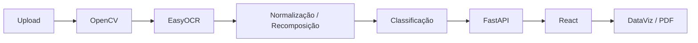

# TAGVision

TAGVision é uma solução para extração inteligente de informações em fluxogramas industriais e diagramas P&ID. O projeto combina processamento de imagem, OCR, validação técnica e visualização de resultados em uma interface web.

## Problema

Diagramas industriais podem ter baixa resolução, poluição visual, símbolos sobrepostos, textos fragmentados e variações de padrão entre plantas. Esses fatores dificultam a extração automática de TAGs e a classificação confiável de equipamentos, instrumentos e válvulas.

## Solução

O pipeline atual executa as seguintes etapas:

1. Recebe uma imagem de planta técnica pelo frontend.
2. Processa a imagem com OpenCV, incluindo escala de cinza, blur, limiarização e detecção de contornos.
3. Aplica OCR com EasyOCR nas regiões candidatas.
4. Normaliza textos reconhecidos.
5. Recompõe espacialmente TAGs fragmentadas, como prefixos e números detectados em regiões separadas.
6. Valida TAGs contra um catálogo técnico em CSV.
7. Classifica cada detecção por tipo, classe, grupo e status.
8. Expõe os resultados por uma API FastAPI.
9. Apresenta os dados em um frontend React/Vite com painéis de DataViz.
10. Gera relatório PDF para análises concluídas.

## Informações Extraídas

- TAG
- Tipo
- Classe
- Grupo
- Status
- Confiança OCR

## Grupos Suportados

- Equipamentos
- Válvulas / Atuadores
- Segurança / Proteção
- Controle
- Instrumentação
- Não cadastrado

## Arquitetura



## Avaliação

O projeto possui um framework de avaliação em `projeto/evaluation/`, baseado em um arquivo de ground truth validado manualmente e nos resultados gerados pelo pipeline.

Baseline atual da amostra validada manualmente:

| Métrica | Valor |
|---|---:|
| Imagens avaliadas | 6 |
| TAGs de referência | 38 |
| TP | 38 |
| FP | 2 |
| FN | 0 |
| Precision | 95.0% |
| Recall | 100.0% |
| F1-Score | 0.9744 |

Esses resultados são obtidos em uma amostra validada manualmente e não representam uma garantia universal para qualquer diagrama.

## Matriz de Confusão

O projeto gera uma matriz de confusão de status a partir do framework de avaliação existente. O arquivo atual fica em:

```text
projeto/evaluation/results/confusion_matrix_status.csv
```

Matriz atual:

| Status real \ Status previsto | Identificado | Possível TAG | Desconhecido |
|---|---:|---:|---:|
| Identificado | 5 | 0 | 0 |
| Possível TAG | 0 | 33 | 0 |
| Desconhecido | 0 | 0 | 0 |

## Como Executar

### Backend

Crie e ative um ambiente virtual Python, se necessário:

```bash
python -m venv .venv
```

No Windows:

```bash
.venv\Scripts\activate
```

Instale as dependências do backend:

```bash
pip install -r projeto/requirements.txt
```

Inicie a API FastAPI:

```bash
python -m uvicorn projeto.api:app --reload
```

A API fica disponível em:

```text
http://localhost:8000
```

### Frontend

Entre na pasta do frontend:

```bash
cd frontend
```

Instale as dependências:

```bash
npm install
```

Inicie o Vite:

```bash
npm run dev
```

O frontend fica disponível em:

```text
http://localhost:5173
```

### Avaliação do Modelo

Com as dependências do backend instaladas, execute:

```bash
python projeto/evaluation/evaluate.py
```

Os resultados são salvos em:

```text
projeto/evaluation/results/
```

## Endpoints

| Método | Endpoint | Descrição |
|---|---|---|
| GET | `/health` | Verifica se a API está ativa. |
| POST | `/process-image` | Recebe uma imagem JPG/PNG e retorna detecções, estatísticas e URL da imagem anotada. |
| GET | `/download-report/{report_id}` | Gera e baixa o relatório PDF de uma análise concluída. |
| GET | `/evaluation-metrics` | Retorna métricas de avaliação e matriz de confusão geradas pelo framework de avaliação. |

## Estrutura do Projeto

```text
.
├── frontend/
│   ├── src/
│   │   ├── components/
│   │   ├── services/
│   │   ├── utils/
│   │   ├── App.jsx
│   │   ├── index.css
│   │   └── main.jsx
│   └── package.json
├── projeto/
│   ├── api.py
│   ├── image_processing.py
│   ├── main.py
│   ├── requirements.txt
│   ├── dataset/
│   ├── evaluation/
│   │   ├── evaluate.py
│   │   ├── ground_truth.csv
│   │   └── results/
│   ├── reports_api/
│   ├── results_api/
│   └── temp/
├── resultados/
├── tabela_equipamentos.csv
├── iniciar_hackathon.bat
└── parar_hackathon.bat
```

## Tecnologias

Backend:

- Python
- FastAPI
- Uvicorn
- OpenCV
- EasyOCR
- pandas
- NumPy
- python-multipart
- ReportLab

Frontend:

- React
- Vite
- Axios
- lucide-react
- oxlint

## Limitações Atuais

- O OCR pode variar conforme qualidade, resolução e contraste do documento.
- Diagramas fora dos padrões suportados podem exigir ajustes de parâmetros ou regras.
- O catálogo e os prefixos técnicos atuais não representam cobertura completa de ISA-5.1.
- Os resultados dependem da legibilidade do documento e da separação visual das TAGs.

## Diferenciais

- TAGs fora do catálogo podem ser exibidas como `Possível TAG`.
- Recomposição espacial de TAGs fragmentadas.
- Classificação por grupo técnico.
- Benchmark integrado com ground truth e métricas reais.
- Painel visual para análise dos resultados e avaliação do modelo.
- Geração de relatório PDF.

## Equipe
